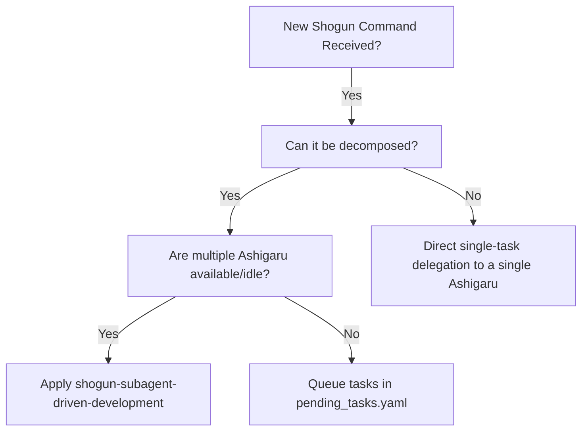
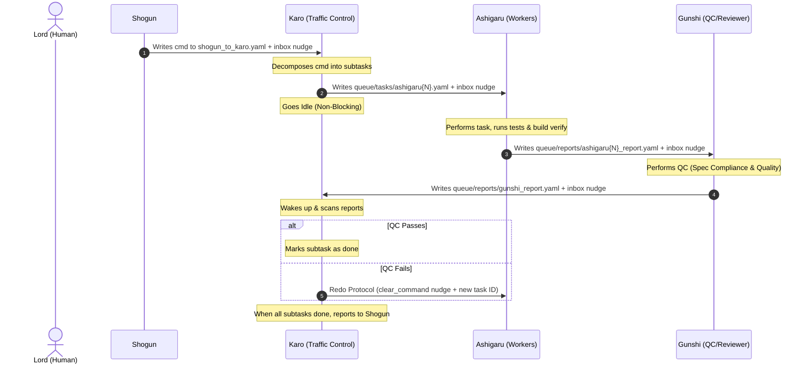

# Subagent-Driven Development (Sengoku Version)

Decompose high-level commands from Shogun and delegate subtasks to parallel **Ashigaru** workers (implementation) and **Gunshi** (quality control/review) via `queue/tasks/` YAML files and `scripts/inbox_write.sh`.

## North Star
**High-efficiency parallel task execution and strict quality gates (QC) utilizing the Sengoku multi-agent hierarchy without direct execution by Karo.**

---

## When to Use



- **Sengoku Task Delegation:** Use when Karo needs to coordinate the parallel execution of multiple subtasks by Ashigaru.
- **Strict Quality Control (QC):** Use when every deliverable must pass a two-stage quality review (spec compliance and code quality) by Gunshi before being marked complete.

---

## The Process



### 1. Planning and Decomposition (Karo)
- Karo reads the command's `purpose` and `acceptance_criteria` from `queue/shogun_to_karo.yaml`.
- Karo decomposes the command into independent, testable subtasks.
- Karo writes subtasks to `queue/tasks/ashigaru{N}.yaml` (maximum 1 active task per Ashigaru to prevent concurrency conflicts).
- Karo follows **Bloom Routing** (L1-L3 implementation tasks assigned to Ashigaru, L4-L6 strategic/review tasks assigned to Gunshi).

### 2. Implementation & Self-Verification (Ashigaru)
- Ashigaru reads its assigned YAML, updates status to `in_progress`, and sets the `@current_task` tmux label.
- Ashigaru implements the task, runs build verification/tests, writes `queue/reports/ashigaru{N}_report.yaml`, sets status to `done`, and notifies Gunshi via `inbox_write.sh`.
- Ashigaru checks its own inbox for any immediate redo/cancellation instructions before going idle.

### 3. Two-Stage Quality Control Review (Gunshi)
- Gunshi reads `queue/tasks/ashigaru{N}.yaml` and `queue/reports/ashigaru{N}_report.yaml`.
- Gunshi performs **Spec Compliance Check** (ensuring all requirements are met line-by-line, without over-engineering or extra features) and **Code Quality Check** (cleanliness, tests, size limits).
- Gunshi writes `queue/reports/gunshi_report.yaml` containing the evaluation and notifies Karo via `inbox_write.sh`.

### 4. Integration and Resolution (Karo)
- Karo scans all report files upon wakeup.
- If Gunshi's QC passes, Karo marks the subtask as completed.
- If Gunshi's QC fails, Karo triggers the **Redo Protocol**:
  - Writes a new task YAML with an incremented task_id (e.g. `subtask_001b2`) and `redo_of` field.
  - Sends a `clear_command` inbox message to the Ashigaru to wipe its volatile context.
- Once all tasks are complete, Karo updates the dashboard, records the daily log, and notifies Shogun.

---

## Task YAML Fields Template

### 1. Ashigaru Task Template (`queue/tasks/ashigaru{N}.yaml`)
See reference file [ashigaru-task-guidelines.md](file:///Users/prince/Workspaces/multi-agent-shogun/skills/shogun-subagent-driven-development/references/ashigaru-task-guidelines.md) for writing detailed task descriptions.

```yaml
task:
  task_id: "subtask_{cmd_id}_{task_name}"
  parent_cmd: "cmd_{cmd_id}"
  bloom_level: L3
  description: |
    Detailed instructions of what to build.
    Prerequisites and files to edit.
  target_path: "path/to/target/file"
  project: "project_name"
  status: assigned
  timestamp: "2026-06-12T00:00:00Z"
```

### 2. Gunshi QC Task Template (`queue/tasks/gunshi.yaml`)
See reference file [gunshi-qc-guidelines.md](file:///Users/prince/Workspaces/multi-agent-shogun/skills/shogun-subagent-driven-development/references/gunshi-qc-guidelines.md) for Gunshi review expectations.

```yaml
task:
  task_id: "gunshi_qc_subtask_{cmd_id}_{task_name}"
  parent_cmd: "cmd_{cmd_id}"
  bloom_level: L5
  description: |
    Perform Quality Control (QC) review on the deliverables of subtask_{cmd_id}_{task_name}.
    Verify:
    1. Spec compliance: [Criteria 1]
    2. Code quality: [Criteria 2]
    Write evaluation to queue/reports/gunshi_report.yaml.
  target_path: "path/to/target/file"
  project: "project_name"
  status: assigned
  timestamp: "2026-06-12T00:00:00Z"
```

---

## Handling Status and Blocker Escalation

### done
Proceed to Gunshi QC review.

### done_with_concerns
Ashigaru flags concerns (e.g., file getting too large, pre-existing code is tangled). Gunshi analyzes these concerns during QC and recommends a path forward in the report.

### blocked / needs_context
Ashigaru cannot proceed. Karo must:
1. **Provide Context:** If it's a context issue, update the task description/context and re-dispatch.
2. **Upgrade Model:** If the task requires higher reasoning, change the assigned Ashigaru's model in settings or assign it to a different pane.
3. **Decompose Further:** If the subtask is too large, split it into smaller tasks.
4. **Escalate to Lord:** If the plan/acceptance criteria are structurally wrong, Karo escalates to the Lord via Shogun delegation (triggering `scripts/telegram_ask.py` on Shogun) or dashboard.md `🚨 Action Required`.

---

## Red Flags & Safe Defaults

- **Never bypass Karo:** Shogun/Lord must never assign tasks directly to Ashigaru.
- **Never perform direct implementation:** Karo must remain a pure manager/traffic controller.
- **Never trust reports blindly:** Gunshi must verify Ashigaru work by reading the actual code diffs.
- **No Concurrent Writes:** Never assign multiple Ashigaru to modify the same file concurrently (prevents git conflicts).
- **Ensure Clean Slate on Redo:** Always send `clear_command` inbox message before re-assigning a task to avoid context pollution.
